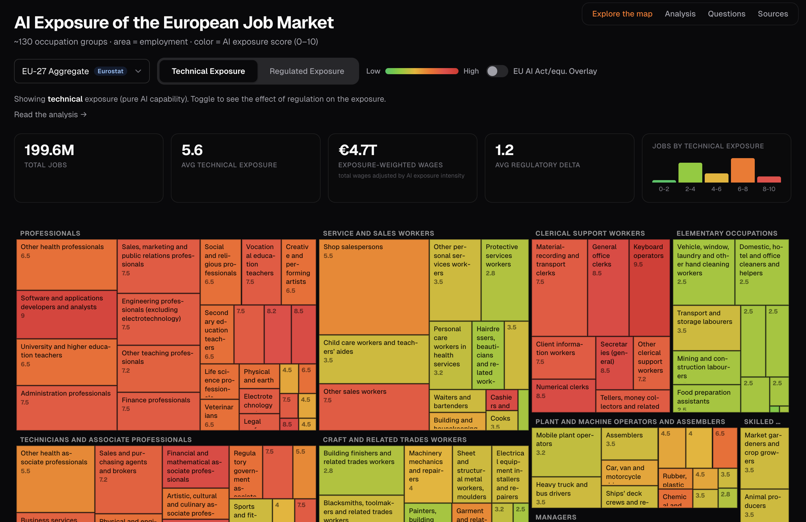

# AI Exposure of the European Job Market

An interactive treemap visualizing AI exposure across ~130 European occupation groups in 36 countries, inspired by [Karpathy's AI Exposure Map](https://karpathy.ai/jobs/).

**What makes this different:** Two scores per occupation — **technical exposure** (what AI *can* do) and **regulated exposure** (what EU law *lets* AI do). The delta between the two reveals where European regulation creates friction for AI adoption. UK-specific scores show what happens with lighter regulation.



## Live Demo

**[ai-exposure.nexalps.com →](https://ai-exposure.nexalps.com)** *(static site, no backend)*

## What's Included

| Page | Description |
|------|-------------|
| [Interactive map](https://ai-exposure.nexalps.com) | Treemap visualization with country selector, score toggle, and EU AI Act overlay |
| [Analysis](https://ai-exposure.nexalps.com/analysis.html) | What AI exposure means for the European job market |
| [Questions](https://ai-exposure.nexalps.com/questions.html) | Questions this data raises for societies, regulators, and enterprises |
| [Sources](https://ai-exposure.nexalps.com/sources.html) | Primary legal texts, papers, books, and reports referenced |
| [llms.txt](https://ai-exposure.nexalps.com/llms.txt) | Machine-readable project summary |

## What's New

### Phase 3.1 — From Risk to Opportunity (March 2026)

Added 5 new treemap layers inspired by [Karpathy's US Job Market Visualizer](https://karpathy.ai/jobs/):

- **Employment Growth** — Cedefop 2035 projections + Eurostat year-over-year (33 countries)
- **Median Pay** — within-country pay percentile (36 countries)
- **Education Level** — tertiary education share from Eurostat LFS (35 countries)
- **Adoption Reality** — triangulated from Anthropic, Microsoft, and OpenAI research
- **AI Augmentation** — composite score identifying the "augmentation sweet spot"

Plus: methodology page, URL parameter deep linking, per-layer narrative insights,
cross-layer insight cards, and collapsible scoring rubrics.

Key insight: *A high AI exposure score does not predict a job will disappear.
It predicts it will change. Where high exposure meets growing demand and an
educated workforce, AI amplifies rather than replaces.*

## The Story

Some occupations barely shift between scores (roofers — no regulation needed because there's no AI exposure). Others shift dramatically (HR managers — technical score 7, regulated score 4 because every AI tool triggers Annex III + works council co-determination).

That delta is the gap between what AI technology can do and what European law allows. The UK, with average friction of 0.5 points (vs. the EU's 1.2), offers the closest thing to a controlled experiment in regulatory divergence.

## Methodology

1. **Occupation data** from [ESCO v1.2.1](https://esco.ec.europa.eu) (~3,000 occupations with rich descriptions)
2. **Employment statistics** from [Eurostat EU-LFS 2024](https://ec.europa.eu/eurostat) at ISCO-08 2-digit, distributed to 3-digit using ESCO structural weights
3. **Wage data** from Eurostat SES 2022, [BFS LSE 2024](https://www.bfs.admin.ch) (Switzerland), [ONS ASHE 2025](https://www.ons.gov.uk) (UK)
4. **AI exposure scoring** via Claude Sonnet 4 (Anthropic), producing three scores per occupation group:
   - `technical_score` (0–10): Pure AI capability. How much *can* AI reshape this job?
   - `regulated_score` (0–10): Practical European exposure, factoring in EU AI Act high-risk obligations, works council consultation, employment protection, and GDPR constraints
   - `uk_regulated_score` (0–10): UK-specific regulated exposure, factoring in Equality Act 2010, UK GDPR Art 22, Employment Rights Act 1996, and the DSIT pro-innovation framework
5. **EU AI Act structured overlay** with Annex III category mapping, deployer/subject classifications, Platform Work Directive relevance, and legal source references
6. **Aggregation** to ISCO-08 3-digit level (~130 groups) for treemap visualization
7. **36 countries** covered: EU-27, UK, Switzerland, and candidate countries (Albania, Bosnia & Herzegovina, North Macedonia, Serbia, Turkey, Montenegro)

### Data Pipeline

```
scripts/01_prepare_esco.py       → Parse ESCO CSVs, extract occupation descriptions + ISCO codes
scripts/02_fetch_eurostat.py     → Fetch employment + wage data from Eurostat API
scripts/03_build_occupations.py  → Merge ESCO + Eurostat, build 3-digit occupation groups
scripts/04_score.py              → Score each group via Anthropic API (Claude Sonnet)
scripts/05_build_site_data.py    → Build site/data.json for the frontend
scripts/06_score_uk.py           → Score UK-specific regulated exposure
scripts/07_score_ai_act.py       → Map EU AI Act Annex III categories + obligations
scripts/08_fetch_bfs.py          → Fetch Swiss wage data from BFS
scripts/09_fetch_ons.py          → Fetch UK wage data from ONS
```

## Setup

### Prerequisites

- Python 3.11+
- An [Anthropic API key](https://console.anthropic.com) for scoring

### Install

```bash
git clone https://github.com/Ph1lM4/ai-job-impact-europe.git
cd european-ai-exposure-map
pip install -e .
```

### Configure

```bash
cp .env.example .env
# Edit .env and add your ANTHROPIC_API_KEY
```

### Run the pipeline

```bash
# 1. Parse ESCO occupation data (requires data/esco/ CSVs)
python scripts/01_prepare_esco.py

# 2. Fetch Eurostat employment + wage data
python scripts/02_fetch_eurostat.py

# 3. Build merged occupation groups
python scripts/03_build_occupations.py

# 4. Score with Claude (costs ~$2-3 for 130 API calls)
python scripts/04_score.py

# 5. Build frontend data file
python scripts/05_build_site_data.py
```

### Preview locally

```bash
cd site && python -m http.server 8000
# Open http://localhost:8000
```

### Skip scoring (use pre-built data)

The repository includes `site/data.json` with pre-scored results, so you can view the treemap without running the scoring pipeline or needing an API key:

```bash
cd site && python -m http.server 8000
```

## Data Sources

| Source | License | What we use |
|--------|---------|-------------|
| [ESCO v1.2.1](https://esco.ec.europa.eu) | EU Commission reuse policy | Occupation descriptions, ISCO codes, skill linkages |
| [Eurostat EU-LFS](https://ec.europa.eu/eurostat) | Eurostat copyright policy | Employment counts by ISCO-08 2-digit |
| [Eurostat SES 2022](https://ec.europa.eu/eurostat) | Eurostat copyright policy | Mean wages by ISCO-08 2-digit |
| [BFS LSE 2024](https://www.bfs.admin.ch) | Swiss open data | Swiss wages by ISCO-08 |
| [ONS ASHE 2025](https://www.ons.gov.uk) | UK Open Government Licence | UK wages by SOC/ISCO |
| [ISCO-08](https://www.ilo.org/public/english/bureau/stat/isco/) | ILO public standard | Occupation classification hierarchy |

## License

**Dual-licensed:**

- **Code** (`scripts/`, `site/*.html`, `site/*.js`, `site/*.css`): [MIT](LICENSE-CODE)
- **Scored data and analysis** (`scores.json`, `site/data.json`, scoring methodology): [CC-BY 4.0](LICENSE-DATA) — © Philipp Maul - Nexalps

Built on ESCO (EU Commission), Eurostat, BFS (Switzerland), and ONS (UK) data.

## Attribution

Inspired by and built upon the approach of [Andrej Karpathy's AI Exposure Map](https://github.com/karpathy/jobs). The European version extends the concept with dual-score methodology (technical vs. regulated exposure) to capture the unique regulatory landscape of the EU labor market, UK-specific scoring for regulatory divergence analysis, and structured EU AI Act overlay with legal source references.

## Contributing

Issues and PRs welcome. If you extend the scoring to additional countries or refine the regulatory mapping, please share back.
