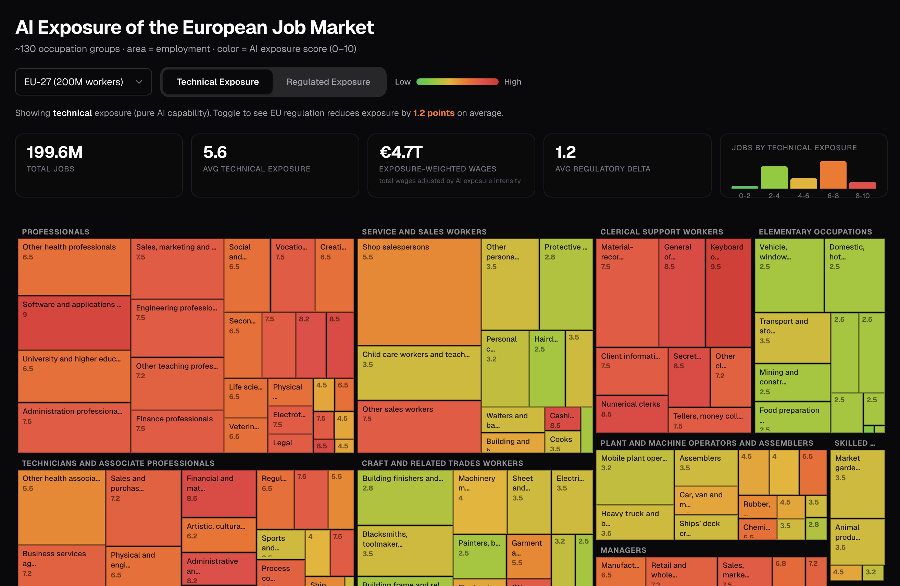

# AI Exposure of the European Job Market

An interactive treemap visualizing AI exposure across ~130 European occupation groups, inspired by [Karpathy's AI Exposure Map](https://karpathy.ai/jobs/).

**What makes this different:** Two scores per occupation — **technical exposure** (what AI *can* do) and **regulated exposure** (what EU law *lets* AI do). The delta between the two reveals where European regulation creates friction for AI adoption.



## Live Demo

**[View the map →](https://ai-exposure.nexalps.com)** *(static site, no backend)*

## The Story

Some occupations barely shift between scores (roofers — no regulation needed because there's no AI exposure). Others shift dramatically (HR managers — technical score 7, regulated score 4 because every AI tool triggers Annex III + works council co-determination).

That delta is the gap between what AI technology can do and what European law allows.

## Methodology

1. **Occupation data** from [ESCO v1.2.1](https://esco.ec.europa.eu) (~3,000 occupations with rich descriptions)
2. **Employment statistics** from [Eurostat EU-LFS 2024](https://ec.europa.eu/eurostat) at ISCO-08 2-digit, distributed to 3-digit using ESCO structural weights
3. **Wage data** from Eurostat Structure of Earnings Survey 2022
4. **AI exposure scoring** via Claude Sonnet 4 (Anthropic), producing two scores per occupation group:
   - `technical_score` (0–10): Pure AI capability. How much *can* AI reshape this job?
   - `regulated_score` (0–10): Practical European exposure, factoring in EU AI Act high-risk obligations, works council consultation, employment protection, and GDPR constraints
5. **Aggregation** to ISCO-08 3-digit level (~130 groups) for treemap visualization

### Data Pipeline

```
scripts/01_prepare_esco.py    → Parse ESCO CSVs, extract occupation descriptions + ISCO codes
scripts/02_fetch_eurostat.py  → Fetch employment + wage data from Eurostat API
scripts/03_build_occupations.py → Merge ESCO + Eurostat, build 3-digit occupation groups
scripts/04_score.py           → Score each group via Anthropic API (Claude Sonnet)
scripts/05_build_site_data.py → Build site/data.json for the frontend
```

## Setup

### Prerequisites

- Python 3.11+
- An [Anthropic API key](https://console.anthropic.com) for scoring

### Install

```bash
git clone https://github.com/Ph1lM4/ai-job-impact-europe.git
cd european-ai-exposure-map
pip install -e .
```

### Configure

```bash
cp .env.example .env
# Edit .env and add your ANTHROPIC_API_KEY
```

### Run the pipeline

```bash
# 1. Parse ESCO occupation data (requires data/esco/ CSVs)
python scripts/01_prepare_esco.py

# 2. Fetch Eurostat employment + wage data
python scripts/02_fetch_eurostat.py

# 3. Build merged occupation groups
python scripts/03_build_occupations.py

# 4. Score with Claude (costs ~$2-3 for 130 API calls)
python scripts/04_score.py

# 5. Build frontend data file
python scripts/05_build_site_data.py
```

### Preview locally

```bash
cd site && python -m http.server 8000
# Open http://localhost:8000
```

### Skip scoring (use pre-built data)

The repository includes `site/data.json` with pre-scored results, so you can view the treemap without running the scoring pipeline or needing an API key:

```bash
cd site && python -m http.server 8000
```

## Data Sources

| Source | License | What we use |
|--------|---------|-------------|
| [ESCO v1.2.1](https://esco.ec.europa.eu) | EU Commission reuse policy | Occupation descriptions, ISCO codes, skill linkages |
| [Eurostat EU-LFS](https://ec.europa.eu/eurostat) | Eurostat copyright policy | Employment counts by ISCO-08 2-digit |
| [Eurostat SES 2022](https://ec.europa.eu/eurostat) | Eurostat copyright policy | Mean wages by ISCO-08 2-digit |
| [ISCO-08](https://www.ilo.org/public/english/bureau/stat/isco/) | ILO public standard | Occupation classification hierarchy |

## License

**Dual-licensed:**

- **Code** (`scripts/`, `site/*.html`, `site/*.js`, `site/*.css`): [MIT](LICENSE-CODE)
- **Scored data and analysis** (`scores.json`, `site/data.json`, scoring methodology): [CC-BY 4.0](LICENSE-DATA) — © Philipp Maul - Nexalps

Built on ESCO (EU Commission) and Eurostat data.

## Attribution

Inspired by and built upon the approach of [Andrej Karpathy's AI Exposure Map](https://github.com/karpathy/jobs). The European version extends the concept with dual-score methodology (technical vs. regulated exposure) to capture the unique regulatory landscape of the EU labor market.

## Contributing

Issues and PRs welcome. If you extend the scoring to additional countries or refine the regulatory mapping, please share back.
